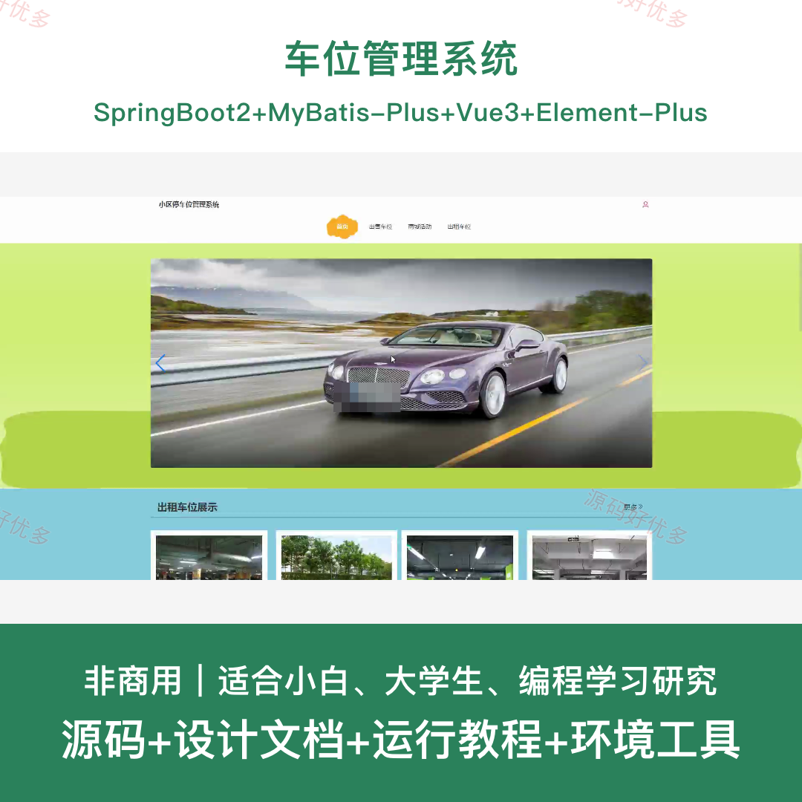
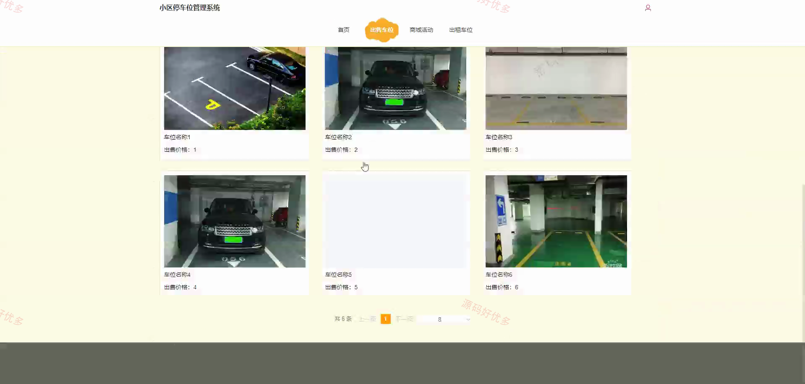
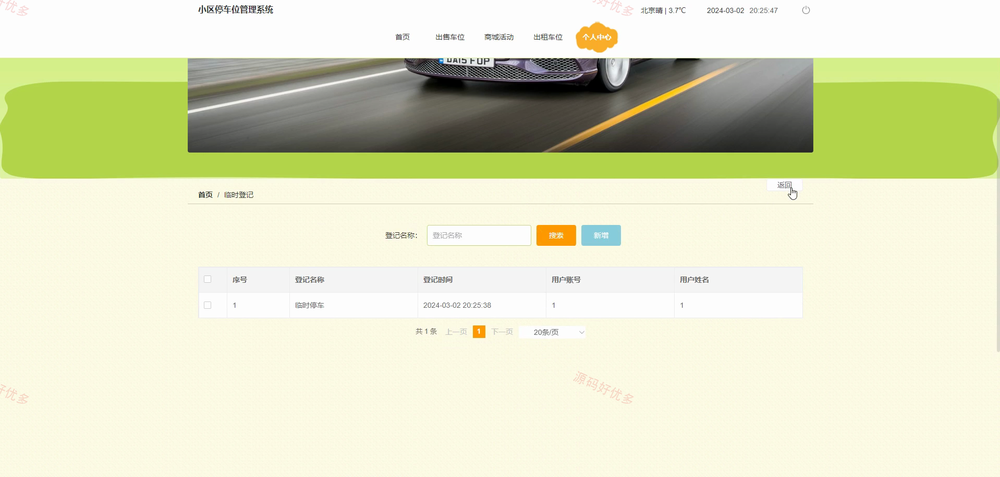
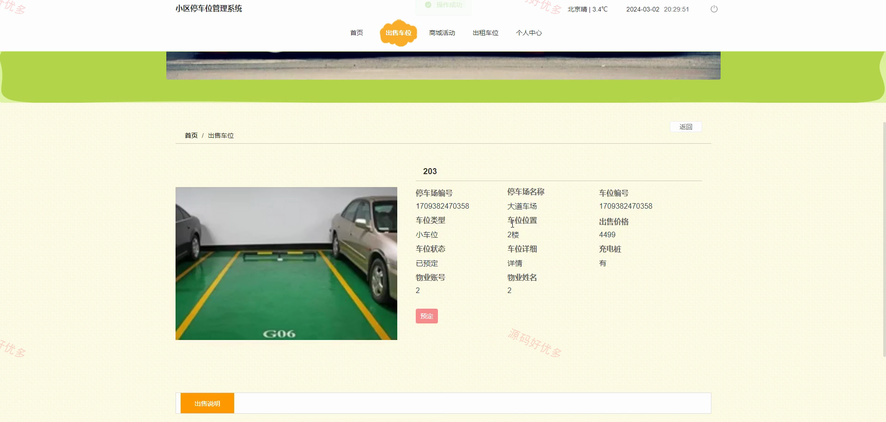
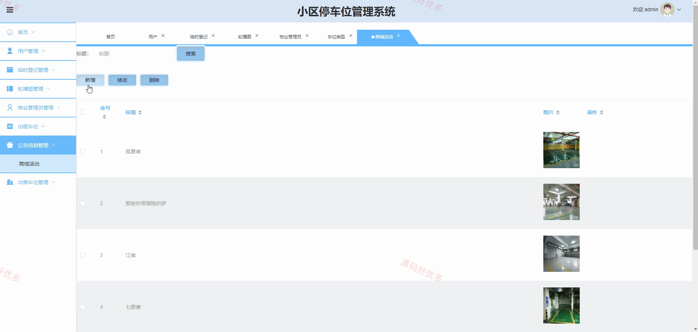
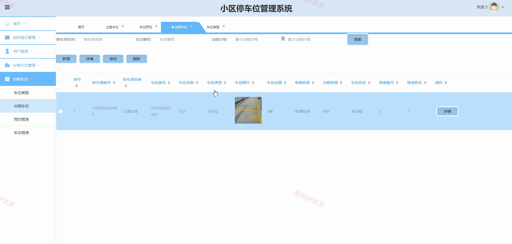
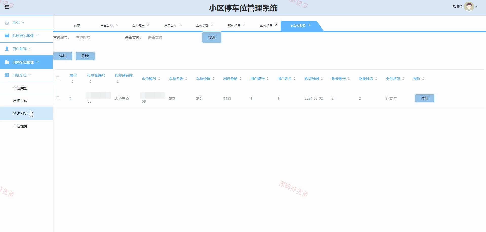
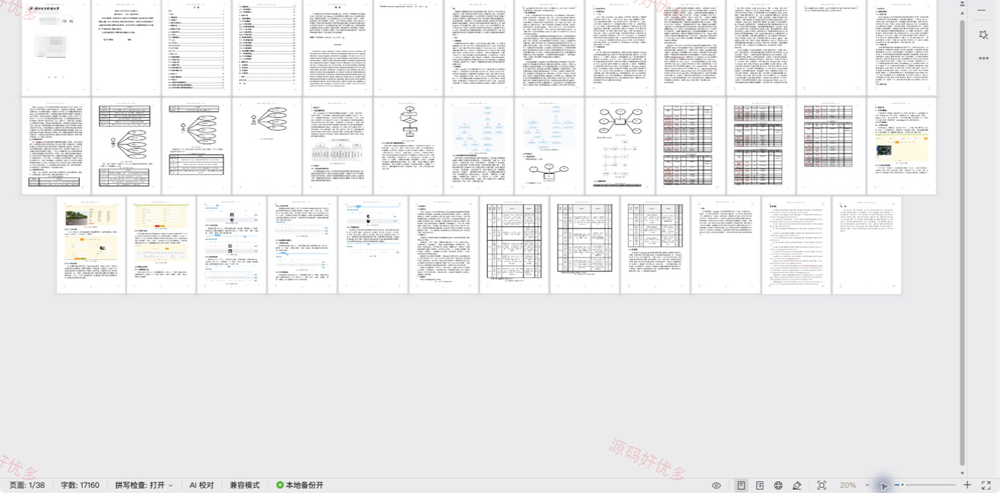

## 源码问题查看主页咨询

### 一、关键词
车位管理系统、车位、车位信息管理、车位后台管理

### 二、作品包含
源码+数据库+设计文档+全套环境和工具资源+本地部署教程

### 三、项目技术
前端技术： Html、Css、Js、Vue3.2、Element-Plus
后端技术：Java、SpringBoot2.2.2、MyBatis-Plus

### 四、运行环境（以下版本亲测，其他版本兼容性请自行测试）
开发工具：IDEA/eclipse + VSCODE

数据库：MySQL5.7+（共15张表）

数据库管理工具：Navicat10以上版本

环境配置软件： JDK1.8 + Maven3.6.3

前端Nodejs：16+

浏览器：谷歌浏览器

### 五、项目介绍
项目编号：springbootA606D

车位管理系统面向管理员、用户、物业管理员，提供临时登记管理、轮播图管理、物业管理员管理、出租车位、公告信息管理、出售车位管理、出售车位查看等功能，实现各角色在系统中的实际业务协作。

角色：管理员、用户、物业管理员

管理员功能：后台登录、用户与物业账号管理、临时停车登记管理、轮播图配置管理、车位类型维护、出租车位及租赁审核、出售车位与预定审核、商城活动公告管理。

用户功能：前台登录注册与个人资料维护、出售车位查看预定及支付、出租车位查看预约租赁及支付、临时停车登记与支付、车位预定管理与支付、车位购买管理与支付、预约租赁管理与支付、商城活动查看。

物业管理员功能：后台登录与注册、用户信息管理、临时停车登记管理、出售车位与预定审核、出租车位与租赁审核、车位类型维护。

### 六、运行截图

